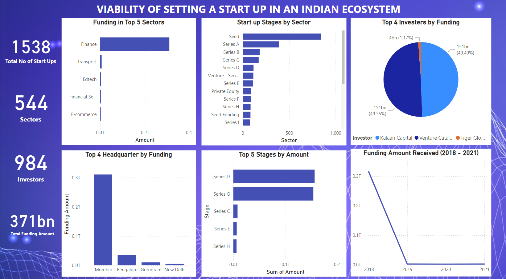

# LP1-Indian-Start-up
This repositiory presents an analysis of funding received by Indian startups from 2018 to 2021 using Exploratory Data Analysis (EDA) techniques. The objective of this analysis was to gain insights into the Indian startup ecosystem, provide valuable information for decision-makers considering entry into the market, and understand the funding and growth patterns of newly launched startups.

## PROJECT SUMMARY 

|Project Code | Project Name | Description | Technology Used | Published Article |
|-------------|--------------|-------------|-----------------|------------------|
|LP1 | Indian-Start-up-Funding-Analysis  | Analysing  the funding received by Indian startups from 2018 to 2021 using Exploratory Data Analysis (EDA) techniques| Python, Pandas, matplotlib, PowerBI |

## Exploratory Data Analysis (EDA)
Exploratory Data Analysis (EDA) plays a vital role in understanding and extracting insights from datasets. It allows us to uncover patterns, relationships, and key characteristics of the data. The main objective of this project is to utilize the CRISP-DM framework as a guiding framework for conducting exploratory data analysis (EDA) and extracting valuable insights. The CRoss Industry Standard Process for Data Mining (CRISP-DM) is a process model that serves as the base for data processing. 

## Introduction
In this project our team is tasked with an assignment to assess the viability of setting up a startup in the indian Ecosystem. We have been provided with various datasets from 2018 to 2021 which will aid us in exploration, analysis and making informed data-driven decisions. The Model we will be using is the *CRISP-DM* model using the *Agile* methodology for a good flow with our project. The *CRISP-DM* stages used in this project are excludig Evaluation and Modeling as we will not be doing any Machine Learning.Therefore the stages we will be going through are Business Understanding, Data Understanding, Data Preparation and In Deployment we will be using Power Bi and Medium for Project Article write-up.

###  Import libraries 
To begin our analysis, we import the necessary libraries and packages that will be used throughout the process. These libraries include:

1. 	Pandas: A powerful tool for data manipulation and analysis, allowing us to handle and manipulate datasets efficiently. It is imported using the statement "import pandas as pd"
2. 	Numpy: A fundamental library for scientific computing in Python, providing a range of mathematical functions and support for multi-dimensional arrays. It enables efficient numerical operations on data and is imported as "import numpy as np".
3. 	Matplotlib: A widely used plotting library that offers various customization options for creating charts, graphs, and plots. It allows us to visualize and communicate our findings effectively. It is imported as "import matplotlib.pyplot as plt".
4. 	Seaborn: A statistical data visualization library built on top of Matplotlib. It provides high-level interfaces for creating visually appealing and informative statistical graphics. It is imported as "import seaborn as sns".

### To Gain Data Insights

1. df.shape(): This function provides the total number of rows and columns in the dataset. In our case, the 2018 dataset has 526 rows and 6 columns, 2019 has 89 rows and 9 coluumns 2020 has 1051 rows and 9 columns and 2021 has 1189 rows, 9 columns.
2. df.head(): This function displays the first five rows of the dataset, giving us a glimpse of the data. Similarly, df.tail() shows the last five rows of the dataset.
3. df.info(): By using this function, we can obtain information about the dataset, including the column names and their data types.  It also informs us about the number of non-null values in each column.

By applying these methods to our dataset, we gain a comprehensive understanding of its structure and content. This allows us to identify any initial issues and establish the purpose of our analysis. It helps us define specific problems to be addressed and derive insights for solving them

###  Hypothesis 
During the analysis process, a null hypothesis is formulated to guide the investigation. Various questions are posed and analyzed to gain insights from the data. Ultimately, the null hypothesis is either accepted or rejected based on the findings derived from the data analysis.

Null Hypothesis (H0): There is no significant difference in the amount of funding received by startups across different sectors and stages.
Alternate Hypothesis (H1): There is a significant difference in the amount of funding received by startups across different sectors and stages.

## Analytical Questions
Funding Trends: How has the total funding amount changed year over year from 2018 to 2021? How has the average funding amount in each sector changed over the years (2018 - 2021)?
Sector Analysis: Which sectors have received the most funding, and how does the funding distribution vary across sectors?
Stage Analysis: What is the distribution of funding across different investment stages (e.g., Pre-seed, Seed, Series A)?
Geographical Analysis: Which cities or regions have the highest concentration of funded startups?
Investor Influence: Who are the top investors in the Indian startup ecosystem, and what is their funding pattern?
Founder Impact: Is there a correlation between the number of founders and the amount of funding received?
Business Viability: Which businesses are more viable to set up based on funding trends and sector analysis?

## Installation
%pip install pyodbc  
%pip install python-dotenv
%pip install seaborn
%pip install openpyxl
%pip install plotly

## Importations
import pyodbc 
from dotenv import dotenv_values 
import numpy as np
import pandas as pd 
import matplotlib.pyplot as plt
import plotly.express as px
import plotly.graph_objs as go
import seaborn as sns
import statsmodels.api as sm
import warnings

warnings.filterwarnings ('ignore')

### Issues with The Data

After looking carefully at the data, the following issues were identified

1. The 2018 Dataset had different and fewer columns
2. There are missing values
3. Some values are in the wrong columns
4. The datatypes of some of the columns need to be changed
5. One column is unnamed

### Handling issues with the data
The following steps were taken to handle the issues with the datasets

1. Analyse the 2018 data separately from the rest
2. Replace missing data with either N/A or the mode of that column depending on the column data
3. Move values in the wrong columns to their appropriate columns
4. Change the datatype of columns to appropriate datatypes
5. Checked the summary statistics to identify any inconsistencies or outliers in the data.
6. Removed any duplicate records to ensure a high level of data accuracy.
7. Adding new columns to the dataset to capture additional information and insights.
8. Performed advanced techniques such as data imputation, outlier detection and handling, and data normalization to further improve the quality of the data.
9. Rename columns.

### Answering the questions. 
Here is a link to the Power Bi Dashboard used for deployment
 https://app.powerbi.com/links/XYnbD6Ma1L?ctid=4487b52f-f118-4830-b49d-3c298cb71075&pbi_source=linkShare
 
The answers to some of the relevants questions above are visualized using the dashbooard below.

### Analysis:
Upon analyzing the datasets for the years 2018, 2019, 2020, and 2021, several key insights were revealed.

Firstly, the Finance sector emerged as the most funded sector, receiving a substantial sum of $3.1 Billion out of the sum of $371 Billion. This sector demonstrated its dominance in attracting investments. Additionally, it was observed that the headquarters located in Mumbai received the highest funding among all the regions.

Secondly, The highest investor in India is Kalaari Capital with a total funding of $151 Billion and was closely followed by Venture Capital with a total funding of $150 Billion. Additionally, The data revealed that Seed D stage received the The highest funding with a total funding of $155 Billion.

### Recommendation:
Based on the analysis of the funding trends from 2018 to 2021, it is clear that the Finance sector has been a frontrunner in attracting investments. This sector has consistently received the highest funding throughout the analyzed period. Therefore, it is recommended for investors and entrepreneurs to explore opportunities within the Finance sector. Investing in technology-driven startups and ventures can potentially yield favorable returns and provide opportunities for growth and innovation.

Furthermore, considering the significant funding received by headquarters located in Mumbai, it may be beneficial to explore the startup ecosystem in this region. Mumbai has shown promising potential as a hub for entrepreneurial activities and investments. Collaborating with local startup communities, attending industry events, and engaging with relevant stakeholders in Mumbai can provide valuable networking opportunities and access to potential investment prospects.

### CONCLUSIONS
Based on the analysis, the Null Hypothesis is rejected because there is a significant difference in the amount of funding received by startups across different sectors and stages.

Therefore, leveraging the insights gained from the analysis, focusing on the Finance Sector, and considering opportunities in Mumbai can enhance the chances of making successful investment decisions and fostering innovation in the startup ecosystem.